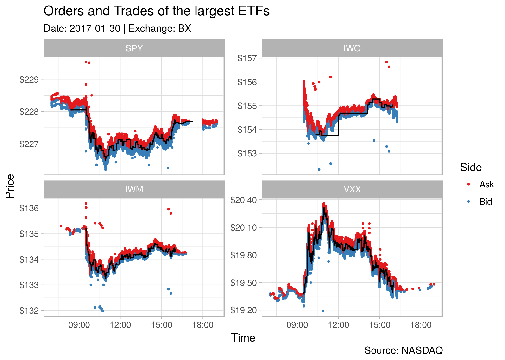

# RITCH - an R interface to the ITCH Protocol

## What?

This R package allows you to read files that use the ITCH protocol (version 5.0) of NASDAQ and parse it into a data.table. 

The ITCH protocol allows NASDAQ to distribute financial information to market participants. The financial information includes orders, trades, order modifications, trading status, traded stocks, and more.

## Why?

During my research I had to parse some ITCH files and couldn't find any R libraries. While parsing the files in pure R is certainly possible, this library uses `C++` and `Rcpp` to speed up the parsing process. 

A typical file containing a single trading day consists of something like 30-50 million messages (BX-exchange) up to 230 million messages (NASDAQ), thus speed makes a crucial difference. As the data is streamed from the file, the execution time mainly depends on the reading/writing speed of the hard-drive. 

As a general benchmark, it takes my machine about 20 seconds to count the messages of a plain-file (unzipped, 55 million order) and about 10 seconds longer for a `.gz`-file.

Enough of the talk, how can I use the package?

## How?

### Installation

Currently the code only lives on GitHub but eventually it should find its way into CRAN. Until then, you have to use `devtools` to install `RITCH`:

```r
# install.packages("devtools")
devtools::install_github("DavZim/RITCH")
```

As a first step, we want to count how often each message is found in a given file.

### Counting Messages
```r
library(RITCH)

# RITCH is able to read *.XXX_ITCH_50.gz files, for speed reasons this file was gunzipped by hand
# the file can be found here: ftp://emi.nasdaq.com/ITCH/
file <- "20170130.BX_ITCH_50"

msg_count <- count_messages(file, add_meta_data = T)
#> [Counting]   54473386 messages found
#> [Converting] to data.table

msg_count
#>     msg_type    count                                  msg_name                                    msg_group  doc_nr
#>  1:        S        6                      System Event Message                         System Event Message     4.1
#>  2:        R     8371                           Stock Directory                       Stock Related Messages   4.2.1
#>  3:        H     8401                      Stock Trading Action                       Stock Related Messages   4.2.2
#>  4:        Y     8502                       Reg SHO Restriction                       Stock Related Messages   4.2.3
#>  5:        L     6011               Market Participant Position                       Stock Related Messages   4.2.4
#>  6:        V        2                MWCB Decline Level Message                       Stock Related Messages 4.2.5.1
#>  7:        W        0                       MWCB Status Message                       Stock Related Messages 4.2.5.2
#>  8:        K        0                 IPO Quoting Period Update                       Stock Related Messages   4.2.6
#>  9:        J        0                       LULD Auction Collar                       Stock Related Messages   4.2.7
#> 10:        A 21142017                         Add Order Message                            Add Order Message   4.3.1
#> 11:        F    20648      Add Order - MPID Attribution Message                            Add Order Message   4.3.2
#> 12:        E  1203625                    Order Executed Message                        Modify Order Messages   4.4.1
#> 13:        C     8467 Order Executed Message With Price Message                        Modify Order Messages   4.4.2
#> 14:        X  1498904                      Order Cancel Message                        Modify Order Messages   4.4.3
#> 15:        D 20282644                      Order Delete Message                        Modify Order Messages   4.4.4
#> 16:        U  3020278                     Order Replace Message                        Modify Order Messages   4.4.5
#> 17:        P   330023                 Trade Message (Non-Cross)                               Trade Messages   4.5.1
#> 18:        Q        0                       Cross Trade Message                               Trade Messages   4.5.2
#> 19:        B        0                      Broken Trade Message                               Trade Messages   4.5.3
#> 20:        I        0                              NOII Message Net Order Imbalance Indicator (NOII) Message     4.6
#> 21:        N  6935487                   Retail Interest Message    Retail Price Improvement Indicator (RPII)     4.7
#>     msg_type    count                                  msg_name                                    msg_group  doc_nr

```

As you can see, there are a lot of different message types. Currently this package parses only messages from the group "Add Order Messages" (type 'A' and 'F'), "Modify Order Messages" (type 'E', 'C', 'X', 'D', and 'U'), and "Trade Messages" (type 'P', 'Q', and 'B'). You can extract the different message-types by using the functions `get_orders`, `get_modifications`, and `get_trades`, respectively. The doc-number refers to the section in the official documentation (see link below).

If you are annoyed by the feedback the function gives you (`[Counting] ... [Converting]...`), you can always turn the feedback off with the `quiet = TRUE` option (this applies to all functions).

If you need more message type compatibility, you are more than welcome to post an issue or open a pull request.

### Retrieve Orders
```r
orders  <- get_orders(file)
#> [Counting]   21162665 messages found
#> [Loading]    ................
#> [Converting] to data.table
#> [Formatting]

orders
#>           msg_type locate_code tracking_number    timestamp order_ref   buy shares stock    price mpid       date            datetime
#>        1:        A        7584               0 2.520001e+13     36132  TRUE 500000  UAMY   0.0001      2017-01-30 2017-01-30 07:00:00
#>        2:        A        3223               0 2.520001e+13     36133  TRUE 500000  GLOW   0.0001      2017-01-30 2017-01-30 07:00:00
#>        3:        A        2937               0 2.520001e+13     36136 FALSE    200   FRP  18.6500      2017-01-30 2017-01-30 07:00:00
#>        4:        A        5907               0 2.520001e+13     36137  TRUE   1500   PIP   3.1500      2017-01-30 2017-01-30 07:00:00
#>        5:        A        5907               0 2.520001e+13     36138 FALSE   2000   PIP   3.2500      2017-01-30 2017-01-30 07:00:00
#>       ---                                                                                                                            
#> 21162661:        A        7021               0 6.838192e+13  78524860 FALSE   2500   SPY 227.6700      2017-01-30 2017-01-30 18:59:41
#> 21162662:        A        7021               0 6.838204e+13  78524862  TRUE   2500   SPY 227.6200      2017-01-30 2017-01-30 18:59:42
#> 21162663:        A        7021               0 6.838213e+13  78524863 FALSE   2500   SPY 227.7200      2017-01-30 2017-01-30 18:59:42
#> 21162664:        A        7021               0 6.838849e+13  78524878 FALSE   2500   SPY 227.6900      2017-01-30 2017-01-30 18:59:48
#> 21162665:        A        8220               0 6.839625e+13  78524903  TRUE    100   XIV  60.6200      2017-01-30 2017-01-30 18:59:56
```

If you want to load only a specified number of messages (this applies to all `get_*` functions), you can always specify a start and end message number.

For example, if you want to get only the first 10 orders, you can use the following code.

```r
orders_small  <- get_orders(file, 1, 10)
#> 10 messages found
#> [Loading]    .
#> [Converting] to data.table
#> [Formatting]

orders_small
#>     msg_type locate_code tracking_number    timestamp order_ref   buy shares stock   price mpid       date            datetime
#>  1:        A        7584               0 2.520001e+13     36132  TRUE 500000  UAMY  0.0001   NA 2017-01-30 2017-01-30 07:00:00
#>  2:        A        3223               0 2.520001e+13     36133  TRUE 500000  GLOW  0.0001   NA 2017-01-30 2017-01-30 07:00:00
#>  3:        A        2937               0 2.520001e+13     36136 FALSE    200   FRP 18.6500   NA 2017-01-30 2017-01-30 07:00:00
#>  4:        A        5907               0 2.520001e+13     36137  TRUE   1500   PIP  3.1500   NA 2017-01-30 2017-01-30 07:00:00
#>  5:        A        5907               0 2.520001e+13     36138 FALSE   2000   PIP  3.2500   NA 2017-01-30 2017-01-30 07:00:00
#>  6:        A        5907               0 2.520001e+13     36139  TRUE   3000   PIP  3.1000   NA 2017-01-30 2017-01-30 07:00:00
#>  7:        A        5398               0 2.520001e+13     36140  TRUE    200   NSR 33.0000   NA 2017-01-30 2017-01-30 07:00:00
#>  8:        A        5907               0 2.520001e+13     36141 FALSE    500   PIP  3.2500   NA 2017-01-30 2017-01-30 07:00:00
#>  9:        A        2061               0 2.520001e+13     36142 FALSE   1300  DSCI  7.0000   NA 2017-01-30 2017-01-30 07:00:00
#> 10:        A        1582               0 2.520001e+13     36143  TRUE    500  CPPL 17.1500   NA 2017-01-30 2017-01-30 07:00:00
```

### Retrieve Trades
```r
trades  <- get_trades(file)
#> [Counting]   330023 messages found
#> [Loading]    ................
#> [Converting] to data.table
#> [Formatting]

trades
#>         msg_type locate_code tracking_number    timestamp order_ref  buy shares stock price match_number cross_type       date            datetime
#>      1:        P        6126               2 2.689416e+13         0 TRUE    100  PULM  3.59        16760         NA 2017-01-30 2017-01-30 07:28:14
#>      2:        P        1622               2 2.821047e+13         0 TRUE    100  CRNT  3.63        16774         NA 2017-01-30 2017-01-30 07:50:10
#>      3:        P        1622               2 2.829043e+13         0 TRUE    100  CRNT  3.63        16775         NA 2017-01-30 2017-01-30 07:51:30
#>      4:        P        1622               2 2.829107e+13         0 TRUE    100  CRNT  3.63        16776         NA 2017-01-30 2017-01-30 07:51:31
#>      5:        P        7443               2 2.881681e+13         0 TRUE    125   TPX 45.81        16814         NA 2017-01-30 2017-01-30 08:00:16
#>     ---                                                                                                                                           
#> 330019:        P        2056               2 6.732688e+13         0 TRUE    100  DRYS  3.21      1559011         NA 2017-01-30 2017-01-30 18:42:06
#> 330020:        P        5296               2 6.733375e+13         0 TRUE    100  NICE 69.69      1559012         NA 2017-01-30 2017-01-30 18:42:13
#> 330021:        P        5296               2 6.735846e+13         0 TRUE    100  NICE 69.63      1559013         NA 2017-01-30 2017-01-30 18:42:38
#> 330022:        P        5632               2 6.752254e+13         0 TRUE    100   OPK  8.51      1559014         NA 2017-01-30 2017-01-30 18:45:22
#> 330023:        P        2056               2 6.753387e+13         0 TRUE    100  DRYS  3.23      1559015         NA 2017-01-30 2017-01-30 18:45:33
```

### Retrieve Order Modifications
```r
changes <- get_modifications(file)
#> [Counting]   26013918 messages found
#> [Loading]    ................
#> [Converting] to data.table
#> [Formatting]

changes
#>           msg_type locate_code tracking_number    timestamp order_ref shares match_number printable price new_order_ref       date            datetime
#>        1:        D        7392               0 2.520556e+13     36168     NA           NA        NA    NA            NA 2017-01-30 2017-01-30 07:00:05
#>        2:        D        3030               0 2.520647e+13     36296     NA           NA        NA    NA            NA 2017-01-30 2017-01-30 07:00:06
#>        3:        D        7392               0 2.520653e+13     36157     NA           NA        NA    NA            NA 2017-01-30 2017-01-30 07:00:06
#>        4:        D        7612               0 2.520664e+13     36361     NA           NA        NA    NA            NA 2017-01-30 2017-01-30 07:00:06
#>        5:        D        7612               0 2.520664e+13     36362     NA           NA        NA    NA            NA 2017-01-30 2017-01-30 07:00:06
#>       ---                                                                                                                                             
#> 26013914:        D        7021               0 6.840003e+13  78524877     NA           NA        NA    NA            NA 2017-01-30 2017-01-30 19:00:00
#> 26013915:        D        5907               0 6.840003e+13  78451076     NA           NA        NA    NA            NA 2017-01-30 2017-01-30 19:00:00
#> 26013916:        D        5907               0 6.840003e+13  78454702     NA           NA        NA    NA            NA 2017-01-30 2017-01-30 19:00:00
#> 26013917:        D        2955               0 6.840003e+13  69844908     NA           NA        NA    NA            NA 2017-01-30 2017-01-30 19:00:00
#> 26013918:        D        4082               0 6.840003e+13  78443320     NA           NA        NA    NA            NA 2017-01-30 2017-01-30 19:00:00
```

To speed up the `get_*` functions, we can use the message-count information from earlier. For example the following code yields the same results as above, but saves time.

```r
orders <- get_orders(file, 1, count_orders(msg_count))
trades <- get_trades(file, 1, count_trades(msg_count))
```


### Create a Plot with Trades and Orders of the largest ETFs
```r
library(ggplot2)

# load the data
orders <- get_orders(file, 1, count_orders(msg_count))
trades <- get_trades(file, 1, count_trades(msg_count))

# data munging
tickers <- c("SPY", "IWO", "IWM", "VXX")
dt_orders <- orders[stock %in% tickers]
dt_trades <- trades[stock %in% tickers]

# for each ticker, use only orders that are within 1% of the range of traded prices
ranges <- dt_trades[, .(min_price = min(price), max_price = max(price)), by = stock]
# filter the orders
dt_orders <- dt_orders[ranges, on = "stock"][price >= 0.99 * min_price & price <= 1.01 * max_price]
# replace the buy-factor with something more useful
dt_orders[, buy := ifelse(buy, "Bid", "Ask")][]
dt_orders[, stock := factor(stock, levels = tickers)]

# data visualization
ggplot() +
  # add the orders to the plot
  geom_point(data = dt_orders, 
             aes(x = datetime, y = price, color = buy), size = 0.5, alpha = 0.2) +
  # add the trades as a black line to the plot
  geom_step(data = dt_trades, 
            aes(x = datetime, y = price)) +
  # add a facet for each ETF
  facet_wrap(~stock, scales = "free_y") +
  # some Aesthetics
  theme_light() +
  labs(title = "Orders and Trades of the largest ETFs",
       subtitle = "Date: 2017-01-30 | Exchange: BX", 
       caption = "Source: NASDAQ",
       x = "Time", y = "Price", 
       color = "Side") +
  scale_y_continuous(labels = scales::dollar) +
  scale_color_brewer(palette = "Set1")
```



## Some considerations

All functions that take a file-name work for both `.gz`-files (i.e., `YYYYMMDD.XXX_ITCH_50.gz`) or or plain-files (`YYYYMMDD.XXX_ITCH_50`). The compressed files will be uncompressed into a temp-file and deleted after the function finishes, if you want to use multiple commands on one file, it might be faster to use `R.utils::gunzip(..., remove = FALSE)` in R or `gunzip -k YYYYMMDD.XXX_ITCH_50.gz` in the terminal and call the functions on the "plain"-file.

Parsing the file specified above (`20170130.BX_ITCH_50.gz`, 714MB gzipped and 1.6GB unzipped) has a peak RAM-consumption of around 7GB on my machine.

If the file is too large for your RAM, you can also process everything in batches by providing a start and end message count. I.e., to only parse the first 1,000 orders, you can use `get_orders(file, 1, 1000)`.

To speed the parsing up, you can also specify the number of messages. I.e., count all messages once using `count_messages`, and then provide the number of trades/orders/order-modifications to `end_msg_count` in each subsequent function call. This saves the parser one trip over the file.

## Additional Sources aka. Data

While this package does not contain any real financial data using the ITCH format, NASDAQ provides some sample datasets on its FTP-server, which you can find here: [ftp://emi.nasdaq.com/](ftp://emi.nasdaq.com/)

If you want to find out more about the protocol, have a look at the official protocol specification, which you can find here: https://www.nasdaqtrader.com/content/technicalsupport/specifications/dataproducts/NQTVITCHspecification.pdf

If you find this package useful or have any other kind of feedback, I'd be happy if you let me know. Otherwise, if you need more functionality for additional message types, please feel free to create an issue or a pull request. 