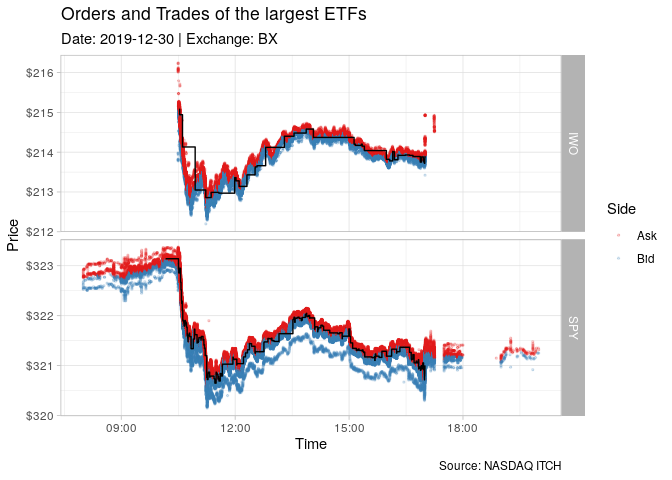

<!-- README.md is generated from README.Rmd. Please edit that file -->

# RITCH - an R interface to the ITCH Protocol

<!-- badges: start -->

[](https://CRAN.R-project.org/package=RITCH) [](https://www.r-pkg.org/pkg/RITCH) [](https://github.com/DavZim/RITCH/actions/workflows/R-CMD-check.yaml)
<!-- badges: end -->

The `RITCH` library provides an `R` interface to NASDAQs ITCH protocol,
which is used to distribute financial messages to participants. Messages
include orders, trades, market status, and much more financial
information. A full list of messages is shown later. The main purpose of
this package is to parse the binary ITCH files to a
[`data.table`](https://CRAN.R-project.org/package=data.table) in `R`.

The package leverages [`Rcpp`](https://CRAN.R-project.org/package=Rcpp)
and `C++` for efficient message parsing.

Note that the package provides a small simulated sample dataset in the
`ITCH_50` format for testing and example purposes. Helper functions are
provided to list and download sample files from NASDAQs official server.

## Install

To install `RITCH` you can use the following

``` r
# stable version:
install.packages("RITCH")

# development version:
# install.packages("remotes")
remotes::install_github("DavZim/RITCH")
```

## Quick Overview

The main functions of `RITCH` are read-related and are easily identified
by their `read_` prefix.

Due to the inherent structural differences between message classes, each
class has its own read function. A list of message types and the
respective classes are provided later in this Readme.

Example message classes used in this example are *orders* and *trades*.
First we define the file to load and count the messages, then we read in
the orders and the first 100 trades

``` r
library(RITCH)
# use built in example dataset
file <- system.file("extdata", "ex20101224.TEST_ITCH_50", package = "RITCH")

# count the number of messages in the file
msg_count <- count_messages(file)
#> [Counting]   12,012 total messages found
#> [Converting] to data.table
#> [Done]       in 0.00 secs at 440.40MB/s
dim(msg_count)
#> [1] 22  2
names(msg_count)
#> [1] "msg_type" "count"

# read the orders into a data.table
orders <- read_orders(file)
#> [Counting]   num messages 12,012
#> [Counting]   num 'orders' messages 5,000
#> [Converting] to data.table
#> [Done]       in 0.08 secs at 5.63MB/s
dim(orders)
#> [1] 5000   13
names(orders)
#>  [1] "msg_type"        "stock_locate"    "tracking_number" "timestamp"       "order_ref"       "buy"            
#>  [7] "shares"          "stock"           "price"           "mpid"            "date"            "datetime"       
#> [13] "exchange"

# read the first 100 trades
trades <- read_trades(file, n_max = 100)
#> [Note]       n_max overrides counting the messages. Number of messages may be off
#> [Filter]     skip: 0 n_max: 100 (1 - 100)
#> [Counting]   num 'trades' messages 300
#> [Converting] to data.table
#> [Done]       in 0.05 secs at 8.86MB/s
dim(trades)
#> [1] 100  14
names(trades)
#>  [1] "msg_type"        "stock_locate"    "tracking_number" "timestamp"       "order_ref"       "buy"            
#>  [7] "shares"          "stock"           "price"           "match_number"    "cross_type"      "date"           
#> [13] "datetime"        "exchange"
```

Note that the file can be a plain `ITCH_50` file or a gzipped
`ITCH_50.gz` file, which will be decompressed to the current directory.
You may also note that the output reports quite a low read speed in the
`MB/s`. This lowish number is due to including the parsing process,
furthermore, due to overhead of setup code, this number gets higher on
larger files.

If you want to know more about the functions of the package, read on.

## Main Functions

`RITCH` provides the following main functions:

- `read_itch(file, ...)` to read an ITCH file Convenient wrappers for
  different message classes such as `orders`, `trades`, etc are also
  provided as `read_orders()`, `read_trades()`, …
- `filter_itch(infile, outfile, ...)` to filter an ITCH file and write
  directly to another file without loading the data into R
- `write_itch(data, file, ...)` to write a dataset to an ITCH file

There are also some helper functions provided, a selection is:

- `download_sample_file(choice)` to download a sample file from the
  NASDAQ server and `list_sample_files()` to get a list of all available
  sample files
- `download_stock_directory(exchange, date)` to download the stock
  locate information for a given exchange and date
- `open_itch_sample_server()` to open the official NASDAQ server in your
  browser, which hosts among other things example data files
- `gzip_file(infile, outfile)` and `gunzip_file(infile, outfile)` for
  gzip functionality
- `open_itch_specification()` to open the official NASDAQ ITCH
  specification PDF in your browser

## Writing ITCH Files

`RITCH` also provides functionality for writing ITCH files. Although it
could be stored in other file formats (for example a database or a
[`qs`](https://CRAN.R-project.org/package=qs) file), ITCH files are
quite optimized regarding size as well as write/read speeds. Thus the
`write_itch()` function allows you to write a single or multiple types
of message to an `ITCH_50` file. Note however, that only the standard
columns are supported. Additional columns will not be written to file!

Additional information can be saved in the filename. By default the
date, exchange, and fileformat information is added to the filename
unless you specify `add_meta = FALSE`, in which case the given name is
used.

As a last note: if you write your data to an ITCH file and want to
filter for stocks later on, make sure to save the stock directory of
that day/exchange, either externally or in the ITCH file directly (see
example below).

### Simple Write Example

A simple write example would be to read all modifications from an ITCH
file and save it to a separate file to save space, reduce read times
later on, etc.

``` r
file <- system.file("extdata", "ex20101224.TEST_ITCH_50", package = "RITCH")
md <- read_modifications(file, quiet = TRUE)
dim(md)
#> [1] 2000   13
names(md)
#>  [1] "msg_type"        "stock_locate"    "tracking_number" "timestamp"       "order_ref"       "shares"         
#>  [7] "match_number"    "printable"       "price"           "new_order_ref"   "date"            "datetime"       
#> [13] "exchange"

outfile <- write_itch(md, "modifications", compress = TRUE)
#> [Counting]   2,000 messages (44,748 bytes) found
#> [Converting] to binary .
#> [Writing]    to file
#> [Outfile]    'modifications_20101224.TEST_ITCH_50.gz'
#> [Done]       in 0.01 secs at 2.36MB/s

# compare file sizes
files <- c(full_file = file, subset_file = outfile)
format_bytes(sapply(files, file.size))
#>   full_file subset_file 
#>  "465.05KB"   "23.95KB"
```

### Comprehensive Write Example

A typical work flow would look like this:

- read in some message classes from file and filter for certain stocks
- save the results for later analysis, also compress to save disk space

``` r
## Read in the different message classes
file <- system.file("extdata", "ex20101224.TEST_ITCH_50", package = "RITCH")

# read in the different message types
data <- read_itch(file,
                  c("system_events", "stock_directory", "orders"),
                  filter_stock_locate = c(1, 3),
                  quiet = TRUE)

str(data, max.level = 1)
#> List of 2
#>  $ stock_directory:Classes 'data.table' and 'data.frame':    2 obs. of  21 variables:
#>   ..- attr(*, ".internal.selfref")=<externalptr> 
#>  $ orders         :Classes 'data.table' and 'data.frame':    2518 obs. of  13 variables:
#>   ..- attr(*, ".internal.selfref")=<externalptr>


## Write the different message classes
outfile <- write_itch(data,
                      "alc_char_subset",
                      compress = TRUE)
#> [Counting]   2,520 messages (95,766 bytes) found
#> [Converting] to binary .
#> [Writing]    to file
#> [Outfile]    'alc_char_subset_20101224.TEST_ITCH_50.gz'
#> [Done]       in 0.01 secs at 2.96MB/s
outfile
#> [1] "alc_char_subset_20101224.TEST_ITCH_50.gz"

# compare file sizes
format_bytes(
  sapply(c(full_file = file, subset_file = outfile),
         file.size)
)
#>   full_file subset_file 
#>  "465.05KB"   "37.89KB"


## Lastly, compare the two datasets to see if they are identical
data2 <- read_itch(outfile, quiet = TRUE)
all.equal(data, data2)
#> [1] TRUE
```

For comparison, the same format in the
[`qs`](https://CRAN.R-project.org/package=qs) format results in `44788`
bytes.
<!---qs::qsave(data, "data.qs", preset = "archive");file.info("data.qs")[["size"]];unlink("data.qs")-->

## ITCH Messages

There are a total of 22 different message types which are grouped into
13 classes by `RITCH`.

The messages and their respective classes are:

| Type           | <code>RITCH</code> Class  | <code>RITCH</code> Read Function              | ITCH Name                                 | ITCH Spec Section |
|:---------------|:--------------------------|:----------------------------------------------|:------------------------------------------|:------------------|
| <code>S</code> | system_events             | <code>read_system_events()</code>             | System Event Message                      | 4.1               |
| <code>R</code> | stock_directory           | <code>read_stock_directory()</code>           | Stock Directory                           | 4.2.1             |
| <code>H</code> | trading_status            | <code>read_trading_status()</code>            | Stock Trading Action                      | 4.2.2             |
| <code>Y</code> | reg_sho                   | <code>read_reg_sho()</code>                   | Reg SHO Restriction                       | 4.2.3             |
| <code>L</code> | market_participant_states | <code>read_market_participant_states()</code> | Market Participant Position               | 4.2.4             |
| <code>V</code> | mwcb                      | <code>read_mwcb()</code>                      | MWCB Decline Level Message                | 4.2.5.1           |
| <code>W</code> | mwcb                      | <code>read_mwcb()</code>                      | MWCB Status Message                       | 4.2.5.2           |
| <code>K</code> | ipo                       | <code>read_ipo()</code>                       | IPO Quoting Period Update                 | 4.2.6             |
| <code>J</code> | luld                      | <code>read_luld()</code>                      | LULD Auction Collar                       | 4.2.7             |
| <code>h</code> | trading_status            | <code>read_trading_status()</code>            | Operational Halt                          | 4.2.8             |
| <code>A</code> | orders                    | <code>read_orders()</code>                    | Add Order Message                         | 4.3.1             |
| <code>F</code> | orders                    | <code>read_orders()</code>                    | Add Order - MPID Attribution Message      | 4.3.2             |
| <code>E</code> | modifications             | <code>read_modifications()</code>             | Order Executed Message                    | 4.4.1             |
| <code>C</code> | modifications             | <code>read_modifications()</code>             | Order Executed Message With Price Message | 4.4.2             |
| <code>X</code> | modifications             | <code>read_modifications()</code>             | Order Cancel Message                      | 4.4.3             |
| <code>D</code> | modifications             | <code>read_modifications()</code>             | Order Delete Message                      | 4.4.4             |
| <code>U</code> | modifications             | <code>read_modifications()</code>             | Order Replace Message                     | 4.4.5             |
| <code>P</code> | trades                    | <code>read_trades()</code>                    | Trade Message (Non-Cross)                 | 4.5.1             |
| <code>Q</code> | trades                    | <code>read_trades()</code>                    | Cross Trade Message                       | 4.5.2             |
| <code>B</code> | trades                    | <code>read_trades()</code>                    | Broken Trade Message                      | 4.5.3             |
| <code>I</code> | noii                      | <code>read_noii()</code>                      | NOII Message                              | 4.6               |
| <code>N</code> | rpii                      | <code>read_rpii()</code>                      | Retail Interest Message                   | 4.7               |

Note that if you are interested in the exact definition of the messages
and its components, you should look into the [official ITCH
specification](https://www.nasdaqtrader.com/content/technicalsupport/specifications/dataproducts/NQTVITCHspecification.pdf),
which can also be opened by calling `open_itch_specification()`.

## Data

The `RITCH` package provides a small, artificial dataset in the ITCH
format for example and test purposes. To learn more about the dataset
check `?ex20101224.TEST_ITCH_50`.

To access the dataset use:

``` r
file <- system.file("extdata", "ex20101224.TEST_ITCH_50", package = "RITCH")
count_messages(file, add_meta_data = TRUE, quiet = TRUE)
#>     msg_type count                 msg_class                                  msg_name  doc_nr
#>  1:        S     6             system_events                      System Event Message     4.1
#>  2:        R     3           stock_directory                           Stock Directory   4.2.1
#>  3:        H     3            trading_status                      Stock Trading Action   4.2.2
#>  4:        Y     0                   reg_sho                       Reg SHO Restriction   4.2.3
#>  5:        L     0 market_participant_states               Market Participant Position   4.2.4
#>  6:        V     0                      mwcb                MWCB Decline Level Message 4.2.5.1
#>  7:        W     0                      mwcb                       MWCB Status Message 4.2.5.2
#>  8:        K     0                       ipo                 IPO Quoting Period Update   4.2.6
#>  9:        J     0                      luld                       LULD Auction Collar   4.2.7
#> 10:        h     0            trading_status                          Operational Halt   4.2.8
#> 11:        A  4997                    orders                         Add Order Message   4.3.1
#> 12:        F     3                    orders      Add Order - MPID Attribution Message   4.3.2
#> 13:        E   198             modifications                    Order Executed Message   4.4.1
#> 14:        C     0             modifications Order Executed Message With Price Message   4.4.2
#> 15:        X    45             modifications                      Order Cancel Message   4.4.3
#> 16:        D  1745             modifications                      Order Delete Message   4.4.4
#> 17:        U    12             modifications                     Order Replace Message   4.4.5
#> 18:        P  5000                    trades                 Trade Message (Non-Cross)   4.5.1
#> 19:        Q     0                    trades                       Cross Trade Message   4.5.2
#> 20:        B     0                    trades                      Broken Trade Message   4.5.3
#> 21:        I     0                      noii                              NOII Message     4.6
#> 22:        N     0                      rpii                   Retail Interest Message     4.7
#>     msg_type count                 msg_class                                  msg_name  doc_nr
```

Note that the example dataset does not contain messages from all classes
but is limited to 6 system messages, 3 stock directory, 3 stock trading
action, 5000 trade, 5000 order, and 2000 order modification messages. As
seen by the 3 stock directory messages, the file contains data about 3
made up stocks (see also the plot later in the Readme).

MASDAQ provides sample ITCH files on their official server at
<https://emi.nasdaq.com/ITCH/Nasdaq%20ITCH/> (or in R use
`open_itch_sample_server()`) which can be used to test code on larger
datasets. Note that the sample files are up to 5GB compressed, which
inflate to about 13GB. To interact with the sample files, use
`list_sample_files()` and `download_sample_files()`.

## Notes on Memory and Speed

There are some tweaks available to deal with memory and speed issues.
For faster reading speeds, you can increase the buffer size of the
`read_` functions to something around 1 GB or more
(`buffer_size = 1e9`).

### Provide Message Counts

If you have to read from a single file multiple times, for example
because you want to extract orders and trades, you can count the
messages beforehand and provide it to each read’s `n_max` argument,
reducing the need to pass the file for counting the number of messages.

``` r
# count messages once
n_msgs <- count_messages(file, quiet = TRUE)

# use counted messages multiple times, saving file passes
orders <- read_orders(file, quiet = TRUE, n_max = n_msgs)
trades <- read_trades(file, quiet = TRUE, n_max = n_msgs)
```

### Batch Read

If the dataset does not fit entirely into RAM, you can do a partial read
specifying `skip` and `n_max`, similar to this:

``` r
file <- system.file("extdata", "ex20101224.TEST_ITCH_50", package = "RITCH")

n_messages <- count_orders(count_messages(file, quiet = TRUE))
n_messages
#> [1] 5000

# read 1000 messages at a time
n_batch <- 1000
n_parsed <- 0

while (n_parsed < n_messages) {
  cat(sprintf("Parsing Batch %04i - %04i", n_parsed, n_parsed + n_batch))
  # read in a batch
  df <- read_orders(file, quiet = TRUE, skip = n_parsed, n_max = n_batch)
  cat(sprintf(": with %04i orders\n", nrow(df)))
  # use the data
  # ...
  n_parsed <- n_parsed + n_batch
}
#> Parsing Batch 0000 - 1000: with 1000 orders
#> Parsing Batch 1000 - 2000: with 1000 orders
#> Parsing Batch 2000 - 3000: with 1000 orders
#> Parsing Batch 3000 - 4000: with 1000 orders
#> Parsing Batch 4000 - 5000: with 1000 orders
```

### Filter when Reading Data

You can also filter a dataset directly while reading messages for
`msg_type`, `stock_locate`, `timestamp` range, as well as `stock`. Note
that filtering for a specific stock, is just a shorthand lookup for the
stocks’ `stock_locate` code, therefore a `stock_directory` needs to be
supplied (either by providing the output from `read_stock_directory()`
or `download_stock_locate()`) or the function will try to extract the
stock directory from the file (might take some time depending on the
size of the file).

``` r
# read in the stock directory as we filter for stock names later on
sdir <- read_stock_directory(file, quiet = TRUE)

od <- read_orders(
  file,
  filter_msg_type = "A",          # take only 'No MPID add orders'
  min_timestamp = 43200000000000, # start at 12:00:00.000000
  max_timestamp = 55800000000000, # end at 15:30:00.000000
  filter_stock_locate = 1,        # take only stock with code 1
  filter_stock = "CHAR",          # but also take stock CHAR
  stock_directory = sdir          # provide the stock_directory to match stock names to stock_locates
)
#> [Filter]     msg_type: 'A'
#> [Filter]     timestamp: 43200000000000 - 55800000000000 
#> [Filter]     stock_locate: '1', '3'
#> NOTE: as filter arguments were given, the number of messages may be off
#> [Counting]   num messages 12,012
#> [Counting]   num 'orders' messages 5,000
#> [Converting] to data.table
#> [Done]       in 0.07 secs at 7.12MB/s

# count the different message types
od[, .(n = .N), by = msg_type]
#>    msg_type    n
#> 1:        A 1082
# see if the timestamp is in the specified range
range(od$timestamp)
#> integer64
#> [1] 43235810473334 55792143963723
# count the stock/stock-locate codes
od[, .(n = .N), by = .(stock_locate, stock)]
#>    stock_locate stock   n
#> 1:            3  CHAR 574
#> 2:            1   ALC 508
```

### Filter Data to File

On larger files, reading the data into memory might not be the best
idea, especially if only a small subset is actually needed. In this
case, the `filter_itch` function will come in handy.

The basic design is identical to the `read_itch` function but instead of
reading the messages into memory, they are immediately written to a
file.

Taking the filter data example from above, we can do the following

``` r
# the function returns the final name of the output file
outfile <- filter_itch(
  infile = file,
  outfile = "filtered",
  filter_msg_type = "A",          # take only 'No MPID add orders'
  min_timestamp = 43200000000000, # start at 12:00:00.000000
  max_timestamp = 55800000000000, # end at 15:30:00.000000
  filter_stock_locate = 1,        # take only stock with code 1
  filter_stock = "CHAR",          # but also take stock CHAR
  stock_directory = sdir          # provide the stock_directory to match stock names to stock_locates
)
#> [Filter]     msg_type: 'A'
#> [Filter]     timestamp: 43200000000000 - 55800000000000 
#> [Filter]     stock_locate: '1', '3'
#> [Bytes]      scanned 465048, filtered 41116
#> [Messages]   scanned 10979, filtered 1082
#> [Done]       in 0.06 secs at 8.19MB/s

format_bytes(file.size(outfile))
#> [1] "41.12KB"

# read in the orders from the filtered file
od2 <- read_orders(outfile)
#> [Counting]   num messages 1,082
#> [Counting]   num 'orders' messages 1,082
#> [Converting] to data.table
#> [Done]       in 0.06 secs at 679.67KB/s

# check that the filtered dataset contains the same information as in the example above
all.equal(od, od2)
#> [1] TRUE
```

## Create a Plot with Trades and Orders of the largest ETFs

As a last step, a quick visualization of the example dataset

``` r
library(ggplot2)
#> Warning: Paket 'ggplot2' wurde unter R Version 4.2.2 erstellt

file <- system.file("extdata", "ex20101224.TEST_ITCH_50", package = "RITCH")

# load the data
orders <- read_orders(file, quiet = TRUE)
trades <- read_trades(file, quiet = TRUE)

# replace the buy-factor with something more useful
orders[, buy := ifelse(buy, "Bid", "Ask")]

ggplot() +
  geom_point(data = orders,
             aes(x = as.POSIXct(datetime), y = price, color = buy), alpha = 0.2) +
  geom_step(data = trades, aes(x = as.POSIXct(datetime), y = price), size = 0.2) +
  facet_grid(stock~., scales = "free_y") +
  theme_light() +
  labs(title = "Orders and Trades of Three Simulated Stocks",
       subtitle = "Date: 2010-12-24 | Exchange: TEST",
       caption = "Source: RITCH package", x = "Time", y = "Price", color = "Side") +
  scale_y_continuous(labels = scales::dollar) +
  scale_color_brewer(palette = "Set1")
#> Warning: Using `size` aesthetic for lines was deprecated in ggplot2 3.4.0.
#> ℹ Please use `linewidth` instead.
```



## Other Notes

If you find this package useful or have any other kind of feedback, I’d
be happy if you let me know. Otherwise, if you need more functionality,
please feel free to create an issue or a pull request.

Citation and CRAN release are WIP.

If you are interested in gaining a better understanding of the internal
data structures, converting data to and from binary, have a look at the
`debug` folder and its contents (only available on the [RITCH’s Github
page](https://github.com/DavZim/RITCH/)).
